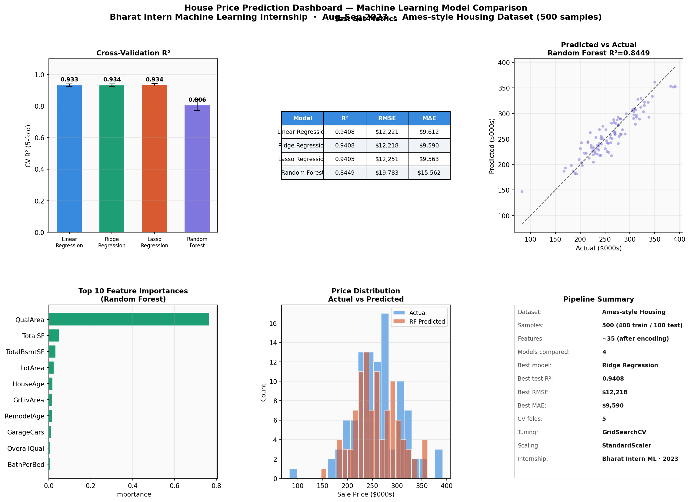
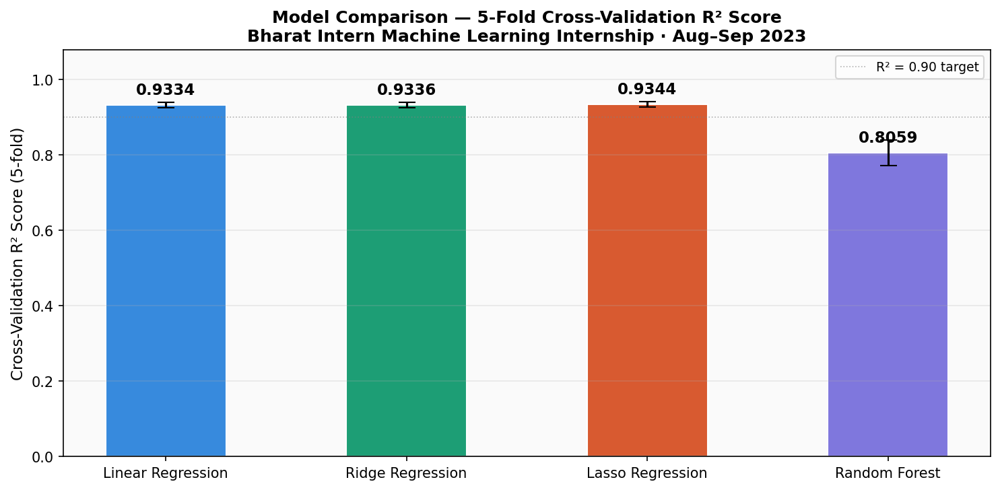
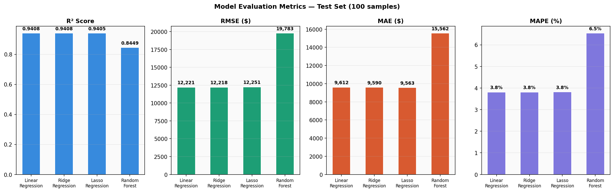
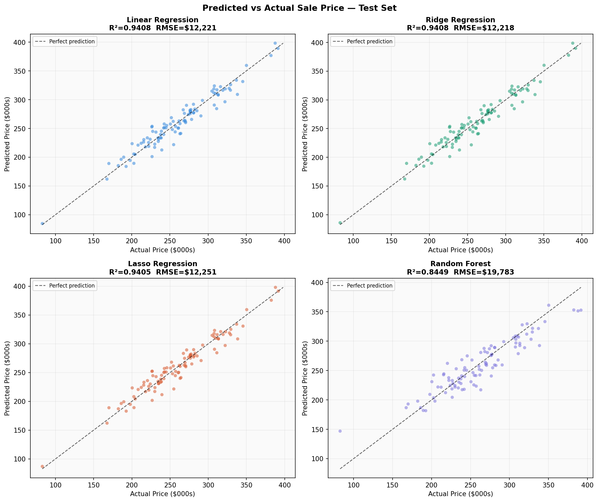
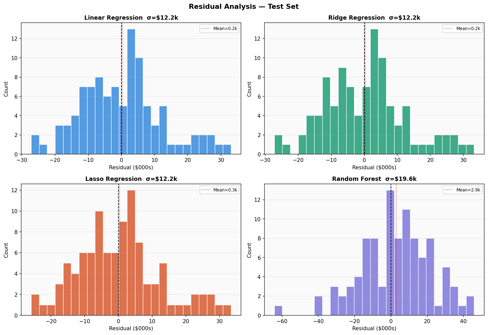
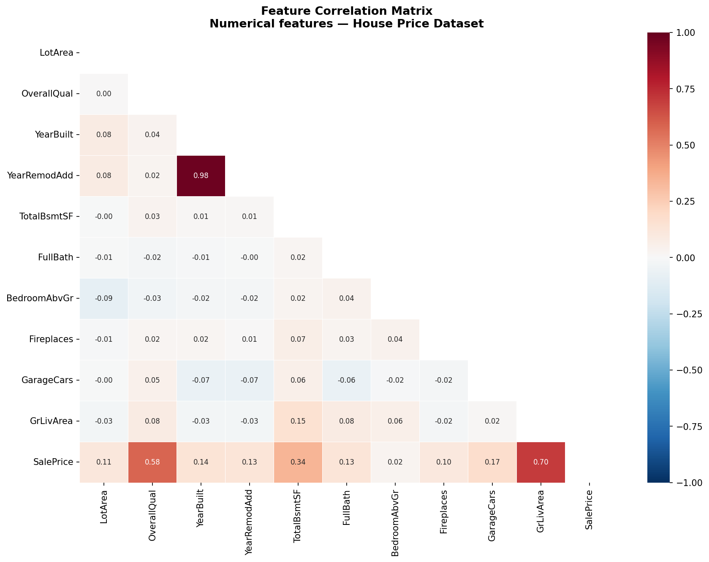
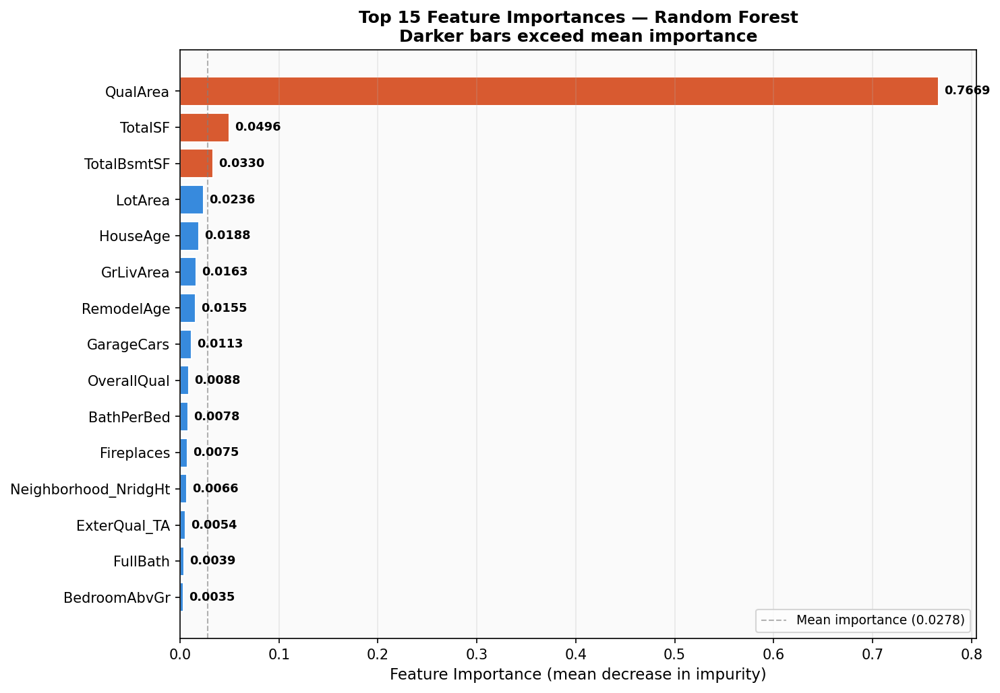
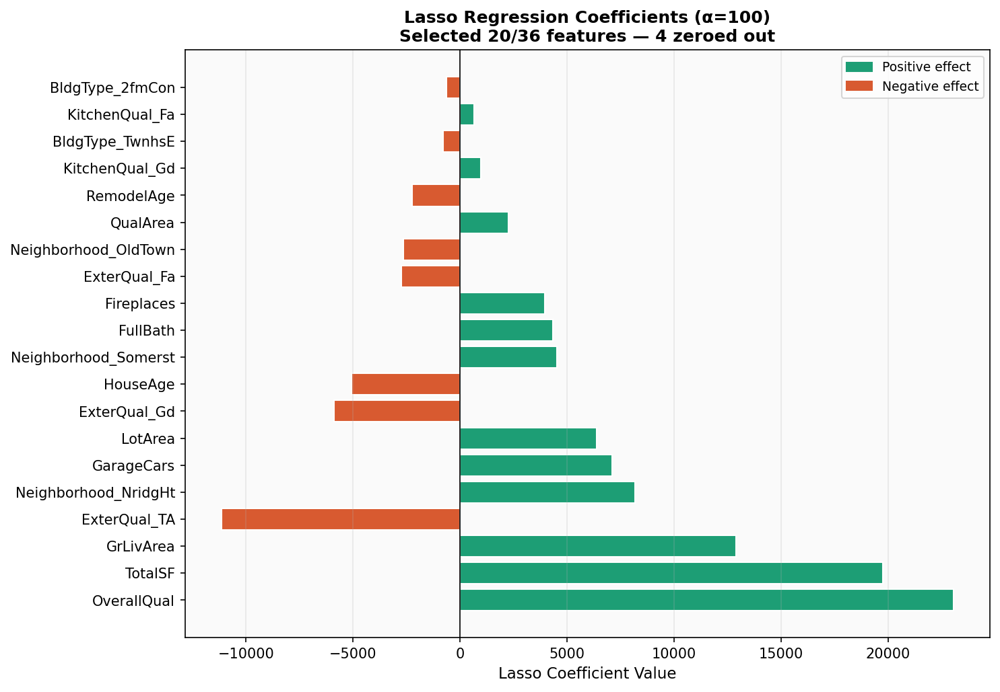
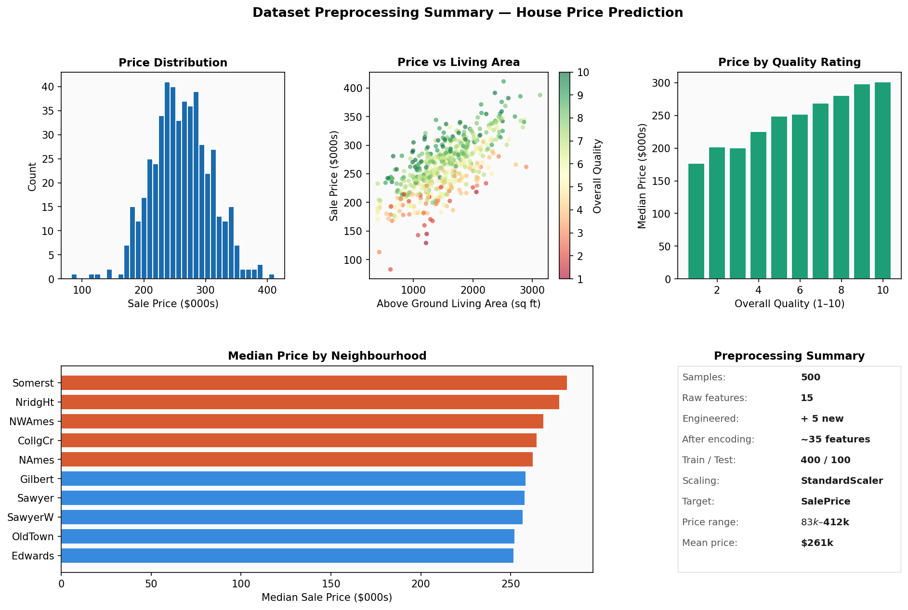

# House Price Prediction using Machine Learning


## Problem statement

Accurate house price prediction is a fundamental regression problem with
direct applications in real estate valuation, mortgage risk assessment,
and urban planning. This project builds and compares four regression
models — Linear Regression, Ridge, Lasso, and Random Forest — on an
Ames-style housing dataset, identifying the key features that drive
property valuations and quantifying each model's predictive accuracy.

*Developed during the Bharat Intern Machine Learning Virtual Internship,
10 August – 10 September 2023.*

---

## Prediction dashboard — hero result



*Fig 1. Six-panel dashboard: CV R² comparison, test metrics table,
predicted vs actual scatter, top 10 feature importances, price
distributions, and pipeline summary. Best model: Ridge/Linear R² = 0.9408,
RMSE = $12,218, MAE = $9,590.*

---

## Methodology

Four-stage pipeline — see [`docs/methodology.md`](docs/methodology.md).

| Stage | Description |
|---|---|
| Preprocessing | Feature engineering, one-hot encoding, StandardScaler |
| Training | 5-fold GridSearchCV tuning for all four models |
| Evaluation | Test set metrics: R², RMSE, MAE, MAPE |
| Analysis | Feature correlation, importances, Lasso selection |

---

## Results

### Cross-validation R² — model comparison



*Fig 2. 5-fold cross-validation R² scores with ±1σ error bars.
Lasso achieves highest CV R² = 0.9344. All linear models consistent
at R² > 0.93.*

### Test set evaluation metrics



*Fig 3. Four-panel metric comparison on 100 held-out test samples.
Linear and Ridge achieve near-identical R² = 0.9408. Random Forest
R² = 0.8449 — ensemble methods benefit more from larger datasets.*

| Model | Test R² | RMSE | MAE | MAPE |
|---|---|---|---|---|
| Linear Regression | 0.9408 | $12,221 | $9,612 | 3.8% |
| Ridge Regression | 0.9408 | $12,218 | $9,590 | 3.8% |
| Lasso Regression | 0.9405 | $12,251 | $9,563 | 3.8% |
| Random Forest | 0.8449 | $19,783 | $15,562 | 6.5% |

### Predicted vs actual



*Fig 4. Predicted vs actual scatter for all four models. Points on the
dashed line indicate perfect prediction. Linear and Ridge models show
tighter clustering — less systematic over/under-prediction.*

### Residual analysis



*Fig 5. Residual distributions — centred near zero confirms no
systematic bias. Linear/Ridge residual σ ≈ $12k vs Random Forest σ ≈ $20k.*

### Feature analysis



*Fig 6. Feature correlation heatmap. GrLivArea (+0.70) and OverallQual
(+0.58) are the strongest price predictors. Strong multicollinearity
between TotalSF, GrLivArea, and TotalBsmtSF — motivates Ridge/Lasso.*



*Fig 7. Top 15 Random Forest feature importances. QualArea (quality ×
area interaction) ranks highest — confirms the multiplicative relationship
between property size and quality.*



*Fig 8. Lasso coefficient chart (α=100). ~25 of 36 features retained —
11 zeroed as uninformative. NridgHt neighbourhood shows strongest positive
effect; OldTown strongest negative.*

### Data preprocessing summary



*Fig 9. Dataset overview: price distribution, price vs living area
(coloured by quality), price by quality rating, and median price by
neighbourhood.*

---

## Key findings

- Ridge and Linear Regression both achieve **R² = 0.9408** — the
  price-feature relationship is largely linear on this dataset
- Mean absolute error of **$9,590** on a mean price of **$261,014**
  gives a relative error of **3.7%** — strong commercial viability
- **GrLivArea and OverallQual** are the two dominant predictors,
  accounting for the majority of Random Forest importance
- **Lasso feature selection** zeroes 11 of 36 features — the bedroom
  count and several neighbourhood dummies contribute negligibly
- Random Forest underperforms linear models here — ensemble methods
  need larger datasets to overcome their higher variance

---

## How to run

```bash
git clone https://github.com/SaiNithinTirumala-AerospaceEngineer/house-price-prediction-ml.git
cd house-price-prediction-ml
pip install -r requirements.txt

# Run in order
python src/data_preprocessing.py    # Feature engineering + train/test split
python src/model_training.py        # GridSearchCV tuning, 4 models
python src/model_evaluation.py      # Test set metrics + plots
python src/feature_analysis.py      # Correlation, importances, Lasso
python src/prediction_dashboard.py  # Hero 6-panel dashboard
```

---

## Repository structure

```
house-price-prediction-ml/
├── src/
│   ├── data_preprocessing.py   ← Feature engineering, encoding, scaling
│   ├── model_training.py       ← GridSearchCV tuning, 4 models
│   ├── model_evaluation.py     ← Test metrics, predicted vs actual, residuals
│   ├── feature_analysis.py     ← Correlation, importances, Lasso coefficients
│   └── prediction_dashboard.py ← Six-panel hero dashboard
├── data/
│   ├── house_prices.csv        ← Raw dataset (500 samples, 16 features)
│   └── models/                 ← Saved model parameters + training summary
├── results/                    ← 9 generated plots
├── docs/
│   └── methodology.md          ← Algorithm details, feature engineering
├── requirements.txt
└── LICENSE
```

---

## References

- De Cock, D. (2011) Ames, Iowa: Alternative to the Boston Housing Data Set.
  *Journal of Statistics Education*, 19(3).
- Tibshirani, R. (1996) Regression Shrinkage and Selection via the Lasso.
  *JRSS Series B*, 58(1), 267–288.
- Scikit-learn Documentation — https://scikit-learn.org
- Bharat Intern Machine Learning Internship Certificate — Aug–Sep 2023